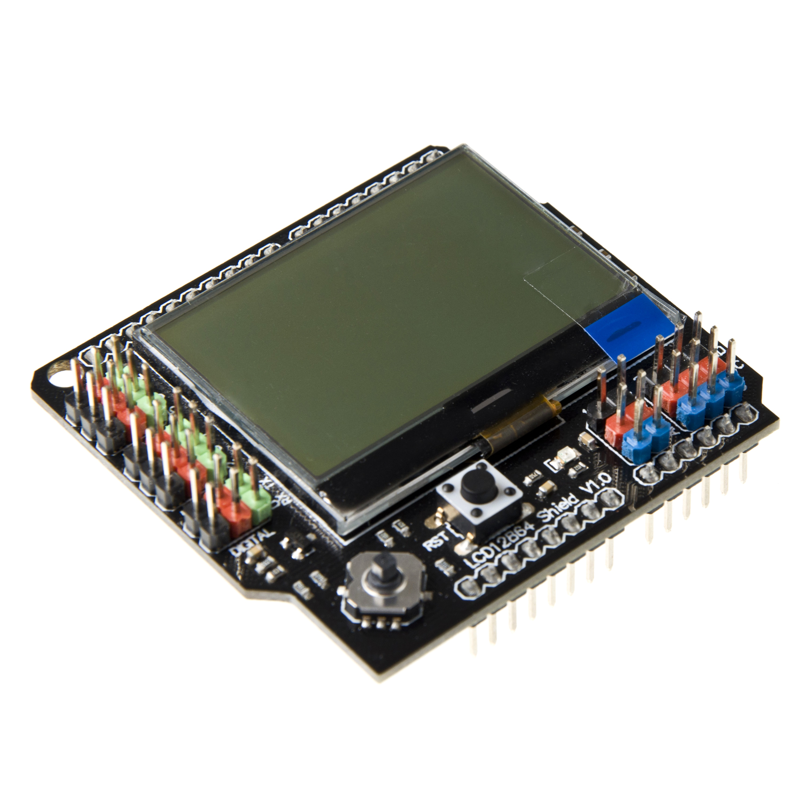
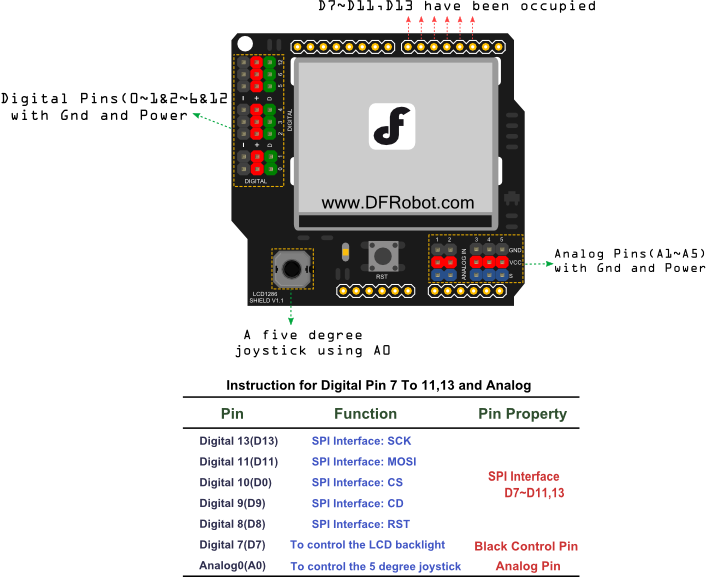
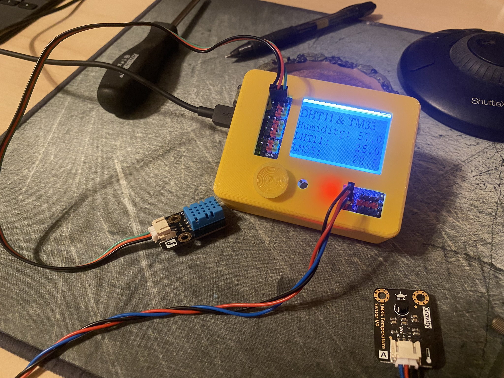

# dfr0287-projects
## DFR0287
Projects with DFRobot's Gravity LCD12864 Shield for Arduino.

* Framed LCD12864 Shield with LED backlight
* Power supply: 3.3V
* Pin used: D7, D8, D9, D10, D11, D13, A0
* Reset button
* 5 degree joystick (using Arduino Analog Pin 0)
* Backlit control (using Arduino Digital Pin 7)
* Extra 5 Analog pins & 8 Digital pins
* Size:60x55x20mm(2.36x2.16x0.79")

https://www.dfrobot.com/product-1084.html

https://wiki.dfrobot.com/LCD12864_Shield_SKU_DFR0287

## Adafruit METRO 328
The Arduino board used is the Adafruit METRO 328

Detailed specifications:

* ATmega328 microcontroller with Optiboot (UNO) Bootloader
* USB Programming and debugging via the well-supported genuine CP2104
* Input voltage: 7-9V (a 9VDC power supply is recommended)
* 5V regulator can supply peak ~800mA as long as the die temp of the regulator does not exceed 150*C
* 3.3V regulator can supply peak ~150mA as long as the die temp of the regulator does not exceed 150*C
* 5V logic with 3.3V compatible inputs, can be converted to 3.3V logic operation
* 20 Digital I/O Pins: 6 are also PWM outputs and 6 are also Analog Inputs
* 6-pin ICSP Header for reprogramming
* 32KB Flash Memory - 0.5K for bootloader, 31.5KB available after bootloading
* 16MHz Clock Speed
* Compatible with "Classic" and "R3" Shields
* Adafruit Black PCB with gold plate on pads
* 53mm x 71mm / 2.1" x 2.8"
* Height (w/ barrel jack): 13mm / 0.5"
* Weight: 19g
* Derivative of "[Arduino UNO R3 Reference design](http://www.arduino.cc/en/Main/ArduinoBoardUno)"
* [Open source hardware files on github](https://github.com/adafruit/Adafruit-METRO-328-PCB)

## PlateformIO
These projects use [Visual Studio Code](https://code.visualstudio.com/) with [PlateformIO](https://platformio.org/) for development.

## 3D Printed Case

[DFRobot DFR0287 Case on Printables](https://www.printables.com/model/506880-dfrobot-dfr0287-case)

