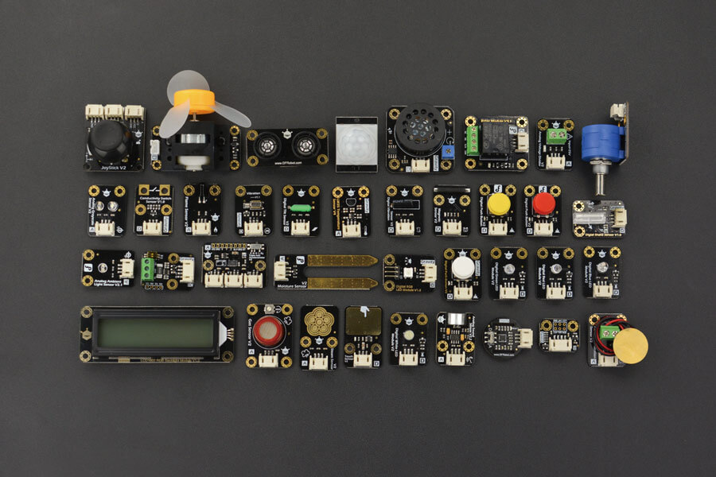
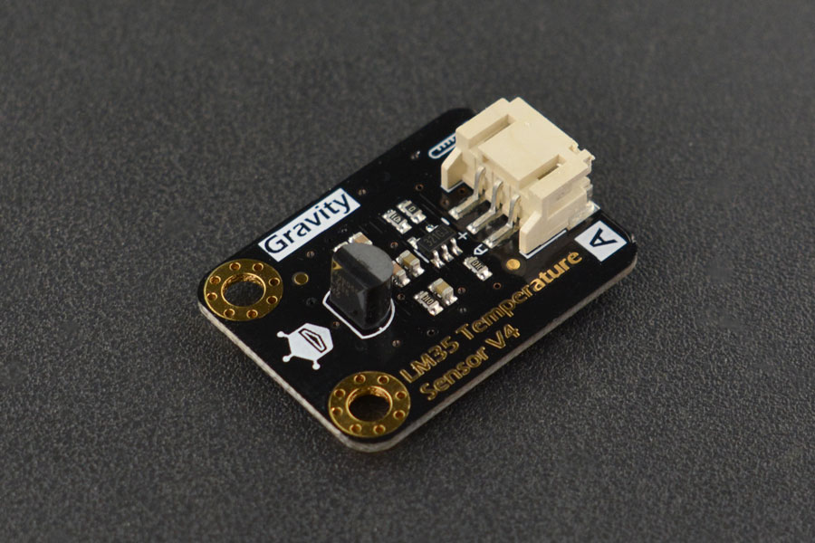

# Sensors

## DFRobot Gravity: 37 PCS Sensor Set

[KIT0150](https://www.dfrobot.com/product-1912.html) contains the following sensors:

* Gravity: TCS34725 RGB Color Sensor For Arduino  [SEN0212]
* Gravity: Heart Rate Monitor Sensor for Arduino    [SEN0203]
* Gravity: I2C Digital Wattmeter  [SEN0291]
* Gravity: Conductivity Sensor Switch - DFRobot  [SEN0223]
* Gravity: Digital Shake Sensor  [SEN0289]
* Gravity: Analog Grayscale Sensor For Arduino  [DFR0022]
* Gravity: Analog LM35 Temperature Sensor For Arduino  [DFR0023]
* Gravity: Analog Ambient Light Sensor For Arduino  [DFR0026]
* Gravity: Digital Vibration Sensor  [DFR0027]
* Gravity: Digital Tilt Sensor for Arduino / Raspberry Pi  [DFR0028]
* Gravity: Digital Capacitive Touch Sensor For Arduino  [DFR0030]
* Gravity: Digital Magnetic Sensor   [DFR0033]
* Gravity: Analog Sound Sensor For Arduino  [DFR0034]
* Gravity: Analog Carbon Monoxide Sensor (MQ7) For Arduino  [SEN0132]
* Gravity: Analog Voltage Divider V2  [DFR0051]
* Gravity: Digital Piezo Disk Vibration Sensor  [DFR0052]
* Gravity: Analog Rotation Potentiometer Sensor V2 For Arduino  [DFR0058]
* Gravity: Joystick Module V2  [DFR0061]
* Gravity: Analog Flame Sensor For Arduino  [DFR0076]
* Gravity: Triple Axis Accelerometer MMA7361  [DFR0143]
* Gravity: Digital Infrared Motion Sensor For Arduino  [SEN0018]
* Gravity: URM09 Analog Ultrasonic Sensor  [SEN0307]
* Gravity: Analog Soil Moisture Sensor For Arduino  [SEN0114]
* Gravity: Steam Sensor   [SEN0121]
* Gravity: Digital Push Button (White)  [DFFR0029-W]
* Gravity: Digital Push Button (Red)-DFRobot  [DFR0029-R]
* Gravity: Digital Push Button (Yellow)  [DFR0029-Y]
* Gravity: Digital White LED Light Module  [DFR0021-W]
* Gravity: Digital RED LED Light Module   [DFR0021-R]
* Gravity: Digital Green LED Light Module  [DFR0021-G]
* Gravity: Digital Blue LED Light Module   [DFR0021-B]
* Gravity: Digital RGB LED Module    [DFR0605]
* Gravity: Digital 5A Relay Module   [DFR0017]
* Gravity: Digital Speaker Module   [FIT0449]
* Gravity: Vibration Motor Module For Arduino  [DFR0440]
* Gravity: 130 DC Motor Module  [DFR0411]
* Gravity: I2C 16x2 Arduino LCD with RGB Backlight Display  [DFR0464]

## Temperature

### DHT11

An inexpensive Temperature and Humidity sensor.  Testing was done with the DFRobot [DFR0067](https://wiki.dfrobot.com/DHT11_Temperature_and_Humidity_Sensor__SKU__DFR0067_).

* Supply Voltage: +5 V
* Temperature range :0-50 °C error of ± 2 °C
* Humidity :20-90% RH ± 5% RH error
* Interface: Digital

### LM35 Linear Temperature Sensor

The LM35 chip is produced by National Semiconductor Corporation and offers a functional range between 0 degree Celsius to 100 degree Celsius with a sensitivity of 10mV per degree Celsius. The output voltage is proportional to the temperature.

Testing done with the DFRobot [DFR0023](https://wiki.dfrobot.com/DFRobot_LM35_Linear_Temperature_Sensor__SKU_DFR0023_).

[Datasheet](../Documentation/Sensors/Temperature/LM35/DFR0023_Datasheet.pdf)

[Schematic](../Documentation/Sensors/Temperature/LM35/LM35%20Schematic.pdf)

* Sensor Chip Model: LM35
* Supply Voltage: 3.3~5.0V
* Sensor Chip Sensitivity: 10mV/℃
* Measuring Range: 0~150℃
* Precision: ±1℃
* Connector Type: PH2.0-3P
* Dimension: 30x22 mm