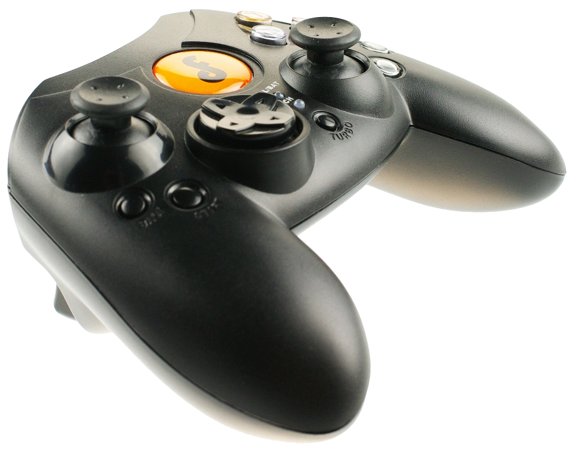
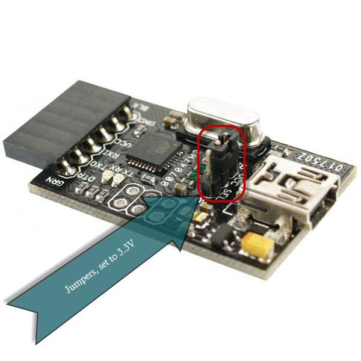
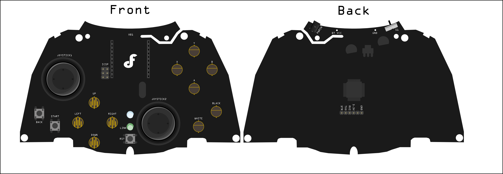

xurlx: /2013/08/dfrobot-wireless-joystick-11-dfr0182_13.html

[](./DFR0182.jpg)  
  
[Wireless Joystick Sketch](./WirelessJoystick.zip)  
  
[Wireless Joystick Schematic](./Wireless-JoyStick-SCH.pdf)  
  
[DFRobot Wiki Page](http://www.dfrobot.com/wiki/index.php?title=Wirless_Joystick_V1.1_(SKU:DFR0182))  
  
The DFRobot's Wireless Joystick V1.1 is similar in size and shape to an XBox controller.  The controller, or gamepad as it is also referred to, is an Arduino Deumilanove w/ATMega 328 and requires either an [FTDI Basic Breakout](./IMGP4613-600x600.jpg "FTDI") or [USB Serial Light Adapter](./IMGP4615-600x600.jpg "USB Serial Light") to program.  The board uses 3.3V, when connecting either the FTDI or USB Adapter verify correct voltage is set on the adapter, via jumpers on the adapter, otherwise you will burn out the gamepad.  
  
  
  
[](/USB_serial_light_adapter.jpg)  
  
To program the Arduino you have to take the gamepad apart. Be careful not to loose the small screws and also be careful when you pull the gamepad apart. The buttons are not physically connected to the PCB and have a tendency to fall out. Also the PCB's power is supplied from the batteries in the bottom shell of the gamepad to the board via two small, short wires. Between the buttons falling out and the wires attached to the PCB programming the gamepad becomes a real chore fast. Oh, and the pins for the USB Serial Light / FTDI are on the bottom of the board so when you have adapter plugged in it is propping up the PCB.  
  
The board has an Xbee socket which supports Xbee, Bluetooth, RF and Wifi.  I used an [Xbee S1](https://www.sparkfun.com/products/8665 "XBee 1mW S1") with no problems. I used an [XBee Explorer USB](https://www.sparkfun.com/products/8687 "XBee Explorer USB") and [X-CTU](http://www.digi.com/support/productdetail?pid=3352 "X-CTU") to configure the XBee S1's.  One pain point I had was that since the Arduino only has one Serial I had to remove the Xbee whenever I wanted to program or monitor the Serial output of the gamepad.  
  
The gamepad comes with the following inputs:  

  
*   2 analog triggers,  
*   2 analog joysticks,  
*   2 joystick buttons,  
*   one D-Pad,  
*   8 buttons,  
*   1 reset buttons.
  

  
[](./DFR0182-Joystick.png)  
  
Finding detailed information on programming the gamepad was difficult, I was able to use a provided [example](http://www.dfrobot.com/wiki/index.php?title=Wirless_Joystick_V1.1_(SKU:DFR0182) "wiki") sketch as a base for a more complete solution.  
  
I had originally wanted a NMEA type string but on the receiving end that would have been a lot of processing.  I finally opted for a simpler Key-Value pair, not quite a dictionary but close:  
  
|**Key**|**Value**|**Description**|
| ---- | ---- | ---- |  
|$BTN:|button name|One of the 14 button names if the button was pressed.|
|$LTRG:|0 - 800  |Left Trigger  |
|$RTRG:|0 - 800  |Right Trigger  |
|$LJSY:|-500 - 500|Left Joystick Y  |
|$LJSX:|-500 - 500|Left Joystick X  |
|$RJSY:|-500 - 500|Right Joystick Y  |
|$RJSX:|-500 - 500|Right Joystick X  |

One of the main issues I had was with calibration of the triggers and joysticks.  Normally the joystick X/Y values should range from 0 to 1023 and at dead center the value should be 512.  None of the joysticks centered at 512 and on one of them the X values didn't quite make it to 1023.  I measured all the center points and added a buffer range around the zero to ensure a zero value is returned.  After that liberal use of the constrain() and map() methods ensured acceptable ranges were returned by the gamepad.  
  
```c
void printJoySticks()
{
    Serial.print("$LJSY: "), Serial.print(mapJoystickValue(joystick[0], leftJoyStickYMidPoint)), Serial.println(";");
    Serial.print("$LJSX: "), Serial.print(-1 * mapJoystickValue(joystick[1], leftJoyStickXMidPoint)), Serial.println(";");

    Serial.print("$RJSY: "), Serial.print(-1 * mapJoystickValue(joystick[2], rightJoyStickYMidPoint)), Serial.println(";");
    Serial.print("$RJSX: "), Serial.print(mapJoystickValue(joystick[3], rightJoyStickXMidPoint)), Serial.println(";");
}

int mapJoystickValue(int value, int midPoint)
{
    int minRange, maxRange, adjustedValue;
    minRange = midPoint - 10;
    maxRange = midPoint + 10;

    adjustedValue = value > minRange && value < maxRange ? 510 : constrain(value, 0, 1020);
    return map(adjustedValue, 0, 1020, -500, 500);
} 
  
```  
  
|**Id**| **Name** |  
| ---- | ---- |
|X|X Button  |
|Y|Y Button  |
|A|A Button  |
|B|B Button  |
|WHITE|White Button  |
|BLACK|Black Button  |
|BACK|Back Button  |
|START|Start Button  |
|UP|D-Pad up  |
|DOWN|D-Pad down  |
|LEFT|D-Pad left  |
|RIGHT|D-Pad right  |
|LJS|Left Joystick Button  |
|RJS|Right Joystick Button  |
  
When capturing the button states I compared the current state to the previous state.  If the button had been pressed during the last loop() then the buttons state is not re-transmitted to the Serial.  This prevents the button from being sent repeatedly to the receiver.  
  
```c 
void printButtons()
{
    for (int i = 0; i < 14; i++)
    {
        if (currButtonState[i] == 0 && prevButtonState[i] != currButtonState[i])
        {
            Serial.print("$BTN: ");
            Serial.print(buttonName[i]);
            Serial.println(";");
        }
        prevButtonState[i] = currButtonState[i];
    }
} 
```  
  
Enough talk, time for code:  
  
```c 
/*  
  
Editor : Darren Pruitt  
Date : 07.24.2013  
  
Product name: Wireless Joystick v1.1 for Arduino  
Product SKU : DFR0182  
Arduino Duemilanove w/ ATmega328P  
Code Version: 1.0  
  
Description:  
The sketch for using the gamepad by printing the button states and the analog values of the triggers and joysticks.  
  
Pin Mapping  
=======================  
D2: X  
D3: Y  
D5: A  
D4: B  
D6: White  
D7: Black  
D8: UP  
D9: LEFT:  
D10: DOWN  
D11: RIGHT  
D12: Back  
D13: Start  
  
X-A0,Y-A1: Left JOY  
D21: Left JOY_BUTTON  
  
X-A2,Y-A3: Right JOY  
D22: Right JOY_BUTTON  
  
A4: Left Z1  
A5: Right Z2  
  
RST : TURBO  
  
*/

// Gamepad Buttons  
String buttonName[14] = { "LJS", "RJS", "Y", "X", "B", "A", "WHITE", "BLACK", "UP", "LEFT", "DOWN", "RIGHT", "BACK", "START" };

int triggerButton[2];
int currButtonState[14];
int prevButtonState[14];

// Gamepad Joysticks  
int joystick[4];

int leftJoyStickXMidPoint, leftJoyStickYMidPoint, rightJoyStickXMidPoint, rightJoyStickYMidPoint;

void setup()
{
    Serial.begin(9600); //Init the Serial baudrate  
    InitIO(); // Initialize the inputs/outputs and the buffers  

    // These values taken from observations of the Joysticks while  
    // they were centered.  
    leftJoyStickXMidPoint = 500;
    leftJoyStickYMidPoint = 503;

    rightJoyStickXMidPoint = 501;
    rightJoyStickYMidPoint = 495;
}

void InitIO()
{
    for (int i = 2; i < 14; i++) pinMode(i, INPUT);
    for (int i = 0; i < 14; i++) prevButtonState[i] = currButtonState[i] = 0;
    for (int i = 0; i < 4; i++) joystick[i] = 0;
    for (int i = 0; i < 2; i++) triggerButton[i] = 0;
}

void loop()
{
    DataUpdate();

    printButtons();
    printJoySticks();
    printTriggers();

    delay(100);
}

void DataUpdate()
{

    for (int i = 2; i < 14; i++) currButtonState[i] = digitalRead(i);
    currButtonState[0] = analogRead(6);
    currButtonState[0] = currButtonState[0] > 100 ? 1 : 0;

    currButtonState[1] = analogRead(7);
    currButtonState[1] = currButtonState[1] > 100 ? 1 : 0;

    for (int i = 0; i < 4; i++) joystick[i] = analogRead(i);
    for (int i = 4; i < 6; i++) triggerButton[i - 4] = analogRead(i);

}

void printButtons()
{
    for (int i = 0; i < 14; i++)
    {
        if (currButtonState[i] == 0 && prevButtonState[i] != currButtonState[i])
        {
            Serial.print("$BTN: ");
            Serial.print(buttonName[i]);
            Serial.println(";");
        }
        prevButtonState[i] = currButtonState[i];
    }
}

void printJoySticks()
{
    Serial.print("$LJSY: "), Serial.print(mapJoystickValue(joystick[0], leftJoyStickYMidPoint)), Serial.println(";");
    Serial.print("$LJSX: "), Serial.print(-1 * mapJoystickValue(joystick[1], leftJoyStickXMidPoint)), Serial.println(";");

    Serial.print("$RJSY: "), Serial.print(-1 * mapJoystickValue(joystick[2], rightJoyStickYMidPoint)), Serial.println(";");
    Serial.print("$RJSX: "), Serial.print(mapJoystickValue(joystick[3], rightJoyStickXMidPoint)), Serial.println(";");
}

void printTriggers()
{
    Serial.print("$LTRG: ");
    Serial.print(map(constrain(triggerButton[0], 0, 800), 0, 800, 500, 0));
    Serial.println(";");

    Serial.print("$RTRG: ");
    Serial.print(map(constrain(triggerButton[1], 0, 800), 0, 800, 500, 0));
    Serial.println(";");
}

int mapJoystickValue(int value, int midPoint)
{
    int minRange, maxRange, adjustedValue;
    minRange = midPoint - 10;
    maxRange = midPoint + 10;

    //adjustedValue = minRange < value < maxRange ? 510 : constrain(value, 0, 1020);;  
    adjustedValue = value > minRange && value < maxRange ? 510 : constrain(value, 0, 1020);
    return map(adjustedValue, 0, 1020, -500, 500);
}
```