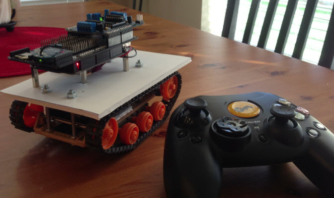
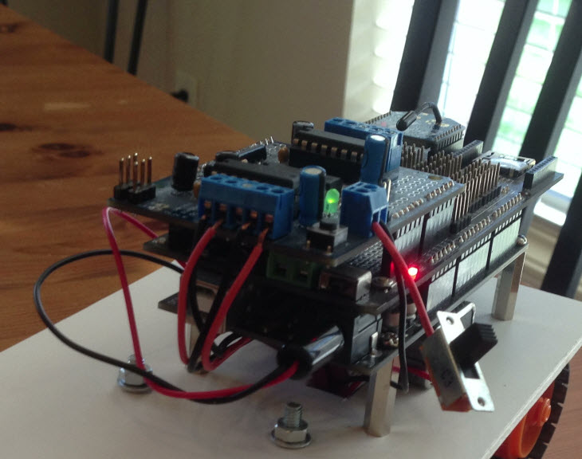
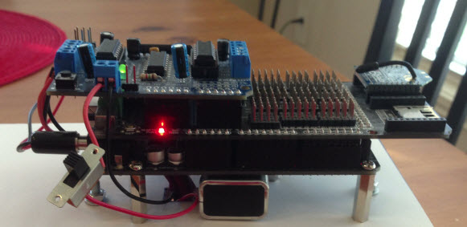
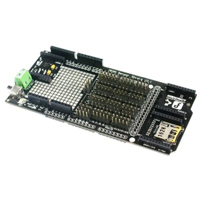
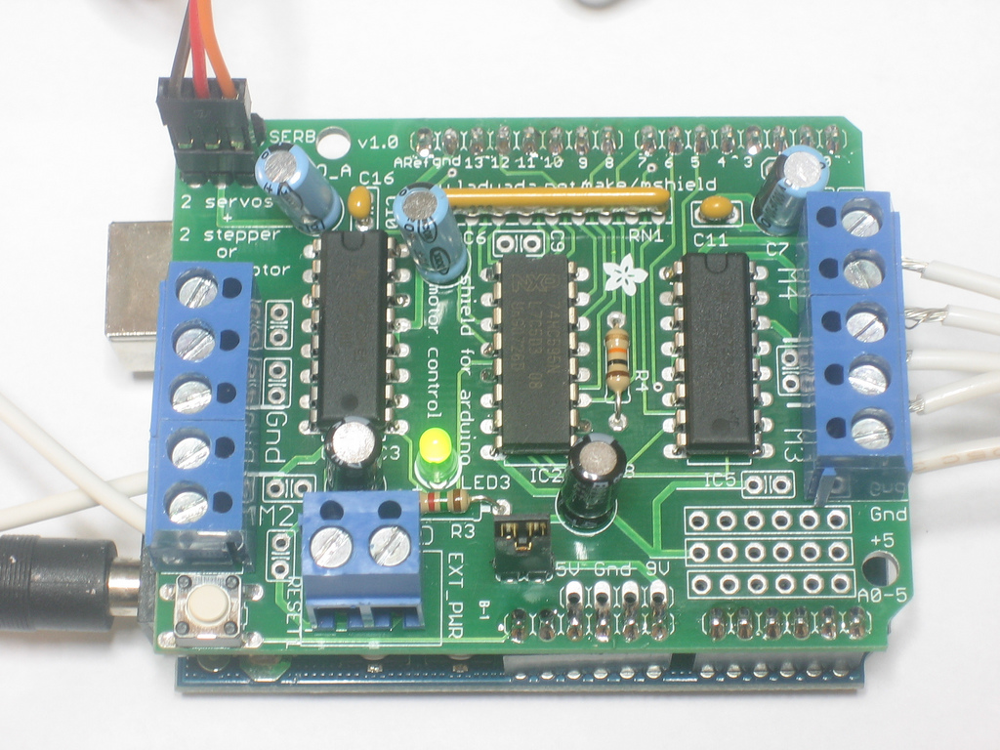

[](./TankAndController01.jpg)  
  
This is my version of the ever popular to build RoboTank. It uses an Arduino Mega 2560 with the AdaFruit motor shield and an XBee S1 to communicate to the DFRobot Gamepad. The sketch for the RoboTank makes use of the AFMotor.h to drive the motors and includes a serial parser to read and process the commands coming from the Gamepad.  
  
[Robotank-Sketch.zip](./RoboTank-Sketch.zip)  
[DFRobot Wireless Joystick](./DFR0182.jpg "DFRobot Wireless Joystick 1.1 (DFR0182)") (EDIT: Discontinued)
  
  
  
 
| Item | Model | Source | Unit Price | Quantity | Cost |
| ---- | ---- | ---- | ---- | ---- | ---- |
| DFRduino Mega 2560 (Arduino Mega Compatible) | DFR0127 | DFRobot | $35.00 | 1 | $35.00 |
| Mega IO Expansion Shield V2.1 For Arduino Mega | DFR0165 | DFRobot | $19.50 | 1 | $19.50 |
| [Wireless GamePad for Arduino](./dfrobot-wireless-joystick-1-1-dfr0182) | DFR0182 | DFR0182 | $57.50 | 1 | $57.50 |
| USB Serial Light Adapter (Arduino Compatible) | DFR0164 | DFRobot | $12.50 | 1 | $12.50 |
| XBee 1mW Wire Antenna (S1) | TEL0014 | DFRobot | $23.50 | 2 | $47.00 |
| XBee Explorer USB | WRL-08687 | SparkFun | $24.95 | 2 | $49.90 |
| Adafruit Motor Shield for Arduino |  | Amazon | $22.50 | 1 | $22.50 |
| Tamiya 70108 Tracked Vehicle Chassis |  | Amazon | $18.40 | 1 | $18.40 |
| Tamiya Universal Plate TAM70098 |  | Amazon | $6.67 | 1 | $6.67 |
| Tamiya 70168 Double Gearbox L/R Independ 4-Speed |  | Amazon | $8.80 | 1 | $8.80 |
  
  
[](./TankArduino01.jpg)  
  
The Arduino is powered by a 9V battery floating under the top plate and the motors are powered by a four cell "AA" battery pack velcro'ed to the bottom behind the motors. Separating the power like this is important as the current draw by the motors could impact the performance of the Arduino. If both the motors and the Arduino used the same power supply you would see sporadic bugs and difficult to trace issues with your code, so you would think. So remember: Separation of Powers.  
  
The switch is used to turn on and off the power to the motors. Unplugging the 9V battery turns off the Arduino.  
  
[](./TankArduino02.jpg)  
  
The [Mega IO Expansion Shield](http://www.dfrobot.com/wiki/index.php/Mega_IO_Expansion_Shield_V2(SKU:DFR0165)) was used for the same reason I used the Mega 2560 Arduino: I had them. The Mega 2560 has three serial IO's which allowed for the XBee to be installed on Serial1 and still monitor Serial when programming the sketch.  
  
[](./dfrobot-mega-io-shield.jpg)  
  
The [Adafruit motor shield](http://learn.adafruit.com/adafruit-motor-shield) was used since it is the most popular.  
  
[](./adafruit-motor-shield.jpg)  
  
For the Serial communication I borrowed heavily from [Serial Comm Fundamentals on Arduino](http://jhaskellsblog.blogspot.com.ar/2011/05/serial-comm-fundamentals-on-arduino.html). Borrowed heavily means "liberally used" his serial code.  
  
Notice though that I am reading from Serial1 since the XBee is plugged into the Serial1 headers.  
  
```c  
//buffer size for NMEA compliant GPS string  
#define DATABUFFERSIZE 80  
char dataBuffer[DATABUFFERSIZE + 1]; //Add 1 for NULL terminator  
byte dataBufferIndex = 0;

boolean getSerialString()
{
    static byte dataBufferIndex = 0;
    while (Serial1.available() > 0)
    {
        char incomingbyte = Serial1.read();
        if (incomingbyte == startChar)
        {
            dataBufferIndex = 0; //Initialize our dataBufferIndex variable  
            storeString = true;
        }
        if (storeString)
        {
            //Let's check our index here, and abort if we're outside our buffer size  
            //We use our define here so our buffer size can be easily modified  
            if (dataBufferIndex == DATABUFFERSIZE)
            {
                //Oops, our index is pointing to an array element outside our buffer.  
                dataBufferIndex = 0;
                storeString = false;
                break;
            }

            if (incomingbyte == endChar)
            {
                dataBuffer[dataBufferIndex] = 0; //null terminate the C string  
                storeString = false;
                //Our data string is complete. return true  
                return true;
            }
            else
            {
                dataBuffer[dataBufferIndex++] = incomingbyte;
                dataBuffer[dataBufferIndex] = 0; //null terminate the C string  
            }
        }
        else
        {
            dataBuffer[0] = 0;
            storeString = false;
            dataBufferIndex = 0;
        }
    }

    //We've read in all the available Serial data, and don't have a valid string yet, so return false  
    return false;
}
```  
  
I also borrowed heavily from the same blog the [Parsing: Quick guide to strtok()](http://jhaskellsblog.blogspot.com.ar/2011/06/parsing-quick-guide-to-strtok-there-are.html). In this case there are only two parts to my "phoNMEA" strings: $CommandName: Value; so parsing was easy. The command name and value are stored in the gamePadCommand array.  
  
```c  
char startChar = '$'; // or '!', or whatever your start character is  
char endChar = 'r';
boolean storeString = false; //This will be our flag to put the data in our buffer  

char delimiters[] = "$: ;";
char gamePadCommand[2][DATABUFFERSIZE+1] ;

void parseNmea(char* nmea, char* delimiters)
{
    *gamePadCommand[0] = '0';
    *gamePadCommand[1] = '0';

    char* curPosition;
    curPosition = strtok(nmea, delimiters);
    if (curPosition == NULL) return;

    strcpy(gamePadCommand[0], curPosition);

    curPosition = strtok(NULL, delimiters);
    if (curPosition == NULL) return;

    strcpy(gamePadCommand[1], curPosition);  
  
}  
```  
  
I initially tried to use a series of **if** statements to process the commands from the gamepad but I ran into a problem with the size of the sketch.  I had a bunch of test code in the sketch and kept adding and adding for more tests until at some point it failed to compile.  It gave a weird error message I couldn't figure out until I realized that as I removed code it suddenly started to compile.  I wound up removing the **if** statements and used function pointers instead, which actually worked better.  
  
```c  
char* commands[7] = { "BTN", "LJSY", "LJSX", "RJSY", "RJSX", "LTRG", "LTRG" };  
void (*commandFunction[7])() = {    handleButton,  
                                    handleJoystick, handleJoystick,  
                                    handleJoystick, handleJoystick,  
                                    handleTrigger, handleTrigger};  
  
```  
  
In the **loop()** function I had to loop through each command name until I found the right command to execute:  
  
```c  
void loop()
{
    if (getSerialString())
    {
        //Serial.println(dataBuffer);  
        parseNmea(dataBuffer, delimiters);

        for (int i = 0; i < 7; i++)
        {
            //Serial.print(gamePadCommand[0]),Serial.print(" : "),Serial.println(commands[i]);  
            if (strcmp(gamePadCommand[0], commands[i]) == 0)
            {
                commandFunction[i]();
                break;
            }
        }
    }
    delay(10);
}
```  
  
The primary commands used are the joystick XY commands. The Left Joystick ($LJSY) controls the Left Track on the tank and conversely the Right Joystick ($RJSY) controls the Right Track. The X values are not currently used.  
  
```c  
void handleJoystick()
{

    if (
    (strcmp(gamePadCommand[0], "RJSX") == 0)
    || (strcmp(gamePadCommand[0], "LJSX") == 0)) return;

    int jsValue;
    jsValue = atoi(gamePadCommand[1]);

    uint8_t directionToGo;
    directionToGo = jsValue > 0 ? FORWARD : BACKWARD;
    jsValue = map(abs(jsValue), 0, 500, 0, 255);

    if ((strcmp(gamePadCommand[0], "RJSY") == 0))
    {
        rightMotor.run(directionToGo);
        rightMotor.setSpeed(jsValue);
    }

    if ((strcmp(gamePadCommand[0], "LJSY") == 0))
    {
        leftMotor.run(directionToGo);
        leftMotor.setSpeed(jsValue);
    }

    Serial.print(gamePadCommand[0]), Serial.print(" : "), Serial.println(jsValue);
}
```  
  
Currently I am not using any of the buttons on the gamepad, I intended for the D-pad to do simple Forward / Back / Turn Left / Turn Right commands but I haven't completed that yet. The code is there but the Joystick code seems to overwrite my results.  
  
Also I should convert the **if** statements to function pointers as well.  
  
```c  
void handleButton() {  
    if(strcmp(gamePadCommand[1],"S1")==0) return;  
    if(strcmp(gamePadCommand[1],"S2")==0) return;  
    if(strcmp(gamePadCommand[1],"Y")==0) return;  
    if(strcmp(gamePadCommand[1],"X")==0) { allStop(); return; }  
    if(strcmp(gamePadCommand[1],"B")==0) return;  
    if(strcmp(gamePadCommand[1],"A")==0) return;  
    if(strcmp(gamePadCommand[1],"WHITE")==0) return;  
    if(strcmp(gamePadCommand[1],"BLACK")==0) return;  
    if(strcmp(gamePadCommand[1],"UP")==0) { goForward(); return; }  
    if(strcmp(gamePadCommand[1],"LEFT")==0) { pivotLeft(); return; }  
    if(strcmp(gamePadCommand[1],"DOWN")==0) { goBack(); return; }  
    if(strcmp(gamePadCommand[1],"RIGHT")==0) { pivotRight(); return; }  
    if(strcmp(gamePadCommand[1],"BACK")==0) return;  
    if(strcmp(gamePadCommand[1],"START")==0) return;  
}  
```  
  
https://www.youtube.com/watch?v=ePgOea3PeyY