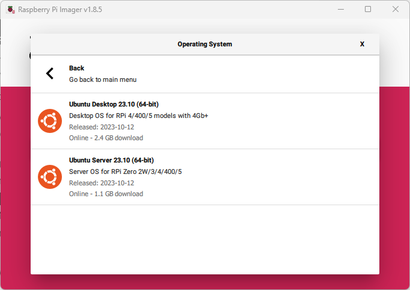
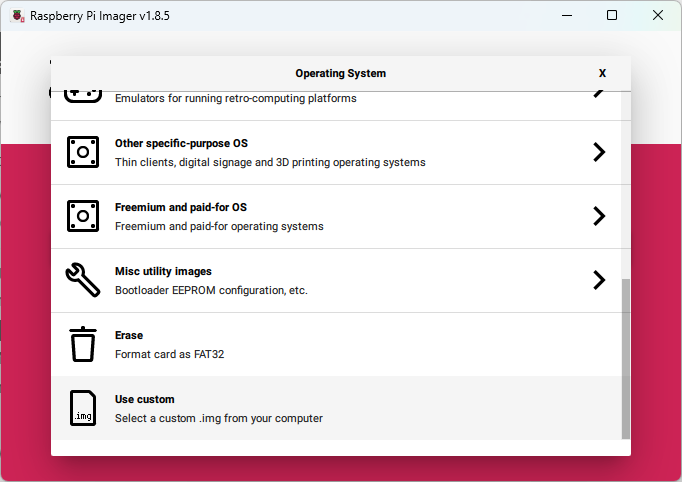

## Goals

The first goal was to install the Ubuntu desktop on the Raspberry Pi 5.  Using the Raspberry Pi OS Imager should have worked but I could never get that version to boot.  Ultimately I had to download the image from Ubuntu and write it to the SD Card.

The second goal was to get the Ubuntu desktop running from an NVMe drive instead of the Raspberry Pi's SD card. 

The NVMe was attached using the [Pimoroni NVMe Base](https://shop.pimoroni.com/products/nvme-base?variant=41219587178579).   

## Pimoroni NVMe Base Installation

Follow the video to attach the base.

The important part is to add the dtparam setting in the /boot/firmware/config.txt file.

```apacheconf
[all]
dtparam=pciex1
```

## Raspberry Pi OS

## Ubuntu

In the Raspberry Pi Imager is the Ubuntu Desktop image.  I tried several times to use this image but each time it failed to boot from the SD card.



Ultimately I found that downloading the image from the [Ubuntu's](https://ubuntu.com/download/raspberry-pi)  Raspberry Pi image site and using the "Use custom" worked.



After creating the image onto an SD card I edited the /boot/firmware/config.txt file to make sure Ubuntu would recognize the NVMe disk.

Boot the Raspberry Pi using the SD card and go thru the initial Ubuntu setup process.  Afterwards update all the apps.

Use ```lsblk``` to verify the NVMe is recognized and to get the device names.  Then use the ```dd``` command to copy the contents of the SD card to the NVMe drive.

```
dd if=/dev/[source_device] of=/dev/[destination_device] bs=4M status=progress
```

For example

```
lsblk  

NAME MAJ:MIN RM SIZE RO TYPE MOUNTPOINTS  
mmcblk0 179:0 0 64.1G 0 disk  
├─mmcblk0p1 179:1 0 512M 0 part /boot/firmware  
└─mmcblk0p2 179:2 0 20.6G 0 part /  
nvme0n1 259:0 0 465.8G 0 disk


dd if=/dev/mmcblk0 of=/dev/nvme0n1 bs=4M status=progress
```

